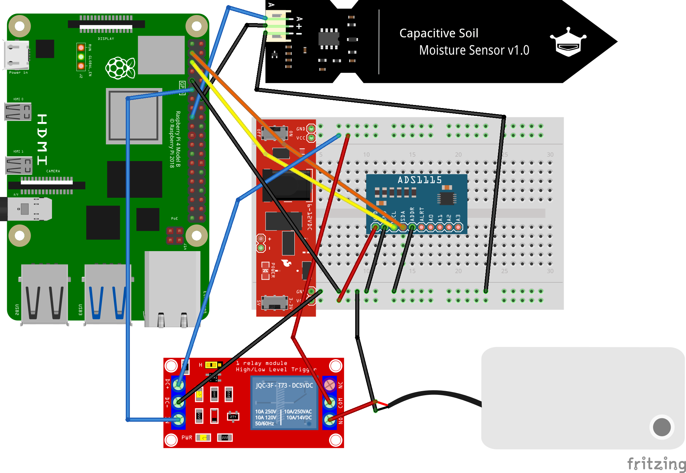

# 💧 Automated Plant Watering with Raspberry Pi

A Raspberry Pi-powered system that automatically checks soil moisture and triggers a water pump when your plant needs a drink — no babysitting required.

## 📋 Prerequisites

Before starting this setup, you **MUST** first complete the AI Plant Review + Moisture Sensor project, which covers Firebase setup, the ADS1115 ADC wiring, and the capacitive soil moisture sensor:

**[GitHub: carolinedunn/AI-Plant-Review-with-Moisture-Sensor](https://github.com/carolinedunn/AI-Plant-Review-with-Moisture-Sensor)**

Once your moisture sensor is wired, calibrated, and returning reliable readings, return here to add the relay module and water pump.

---

## 🚀 Features

- **Automated Watering**: Checks soil moisture on a schedule and triggers a pump relay only when needed.
- **Calibrated Thresholds**: Set your own dry/wet voltage values and moisture percentage trigger point.
- **Safe by Default**: Pump runs for a configurable duration, then shuts off automatically.
- **Cron Scheduling**: Runs hourly with no user interaction required.

---

## 🛠 Additional Hardware Required

In addition to the hardware from the prerequisite project, you will need:

- 1-channel 5V relay module (High/Low Level Trigger)
- 5V submersible mini water pump
- Silicone tubing to fit your pump outlet
- Jumper wires

---

## 🔌 Hardware Wiring

### Wiring Diagram



### 1. Relay Module to Raspberry Pi

| Relay Pin | Raspberry Pi Pin | Function |
|-----------|-----------------|----------|
| VCC       | Pin 2 (5V)       | Relay power supply |
| GND       | Pin 6 (GND)      | Common ground |
| IN        | Pin 11 (GPIO 17) | Control signal |

> **Note:** Based on testing, this relay is **Active High**. The `IS_ACTIVE_HIGH = True` flag in `pumptest.py` reflects this. If your relay does not click when the script runs, try setting it to `False`.

### 2. Pump to Relay

Connect your 5V pump to the relay's **COM** (common) and **NO** (normally open) terminals. When the relay is triggered, it closes the circuit and powers the pump.

The pump's power supply positive wire connects to the **NO** terminal, and the negative wire connects directly back to the power supply ground. Route the 5V power supply positive lead through the relay's **COM** terminal.

---

## 📦 Software Setup

### 1. Install Dependencies

If you completed the prerequisite project, you should already have the required libraries. If not, run:

```bash
sudo apt-get update
pip3 install gpiozero adafruit-circuitpython-ads1x15
```

### 2. Download the Scripts

Copy `pumptest.py` and `check_n_water.py` to your `~/PlantPhotos` directory (or your preferred working directory):

```bash
cp pumptest.py ~/PlantPhotos/
cp check_n_water.py ~/PlantPhotos/
```

---

## 🧪 Testing the Relay and Pump

Before scheduling anything, verify the relay and pump are working correctly.

### Step 1 — Run the Pump Test Script

```bash
python3 ~/PlantPhotos/pumptest.py
```

This script cycles the relay **ON and OFF three times**, pausing 3 seconds in each state. Watch and listen for:

- ✅ An audible **click** when the relay switches
- ✅ The relay's **Status LED** lighting up when ON and dimming when OFF
- ✅ The pump **running** while the relay is active

### Step 2 — Troubleshoot if Needed

| Symptom | Likely Cause | Fix |
|---------|-------------|-----|
| Power LED on, Status LED never lights | Wrong trigger logic | Set `IS_ACTIVE_HIGH = False` in `pumptest.py` |
| Relay clicks but pump doesn't run | Wiring issue | Check COM/NO terminal connections and pump power supply |
| No click at all | GPIO or power issue | Verify VCC/GND connections and the GPIO pin number |

---

## ⚙️ Configuring `check_n_water.py`

Open the script and update the configuration section at the top to match your setup:

```python
# --- CONFIGURATION ---
PUMP_PIN = 17               # GPIO pin connected to relay IN
MOISTURE_THRESHOLD = 30.0   # Trigger watering below this moisture %
WATERING_DURATION = 1.0     # How long to run the pump (seconds)

# --- CALIBRATION CONSTANTS ---
# Use the values you measured during the prerequisite project
V_DRY = 2.0   # Voltage reading in open air (fully dry)
V_WET = 1.0   # Voltage reading fully submerged in water
```

> **Tip:** Start with a short `WATERING_DURATION` (1–2 seconds) and observe how much water is delivered before increasing it.

---

## 🕐 Scheduling with Crontab

To run the moisture check and auto-water every hour, add a cron job:

```bash
crontab -e
```

Add the following line at the bottom of the file:

```bash
# Check soil moisture and water if needed — runs every hour
0 * * * * /usr/bin/python3 ~/PlantPhotos/check_n_water.py >> ~/PlantPhotos/water_log.txt 2>&1
```

This runs `check_n_water.py` at the top of every hour, and appends all output (including errors) to `water_log.txt` for easy debugging.

### Verify the Cron Job

```bash
crontab -l
```

You should see your new entry listed. To confirm it ran, check the log after the next scheduled hour:

```bash
cat ~/PlantPhotos/water_log.txt
```

Expected output when moisture is sufficient:
```
Current Moisture: 62.3%
Moisture level is sufficient. No watering needed.
```

Expected output when watering is triggered:
```
Current Moisture: 18.5%
Moisture is below 30.0%. Starting pump for 1.0s...
Watering complete.
```

---

## 📁 File Summary

| File | Purpose |
|------|---------|
| `pumptest.py` | Diagnostic script — cycles the relay to verify wiring |
| `check_n_water.py` | Main script — reads moisture and triggers pump if needed |

---

## 📚 A Woman's Guide to Winning in Tech

If you enjoyed this repo, check out the book **A Woman's Guide to Winning in Tech** — blending sharp humor with practical career strategies to help women navigate tech on their own terms.

- [Book Website](https://winningintech.com/)
- [Amazon](https://amzn.to/3YxHVO7)
- [Instagram](https://www.instagram.com/winning.tech)
- [Facebook](https://www.facebook.com/winningintech)
